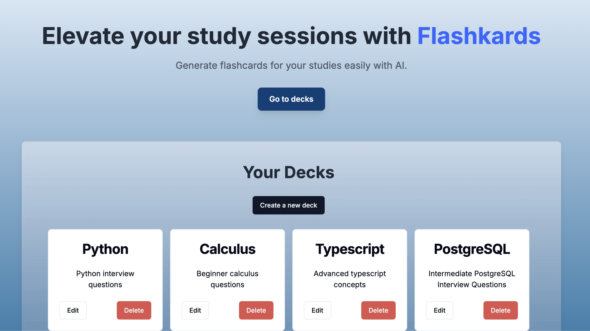

# Flashkards



This is a Flashcards application built with [Next.js](https://nextjs.org/). It allows users to create flashcards for studying.

## Getting Started

To run the development server, use the following command:

``` bash
npm run dev
```

Then, open <http://localhost:3000> in your browser to see the app in action.

## Features

-   Create new flashcards
-   Edit existing flashcards
-   Delete flashcards
-   Navigate through flashcards

## Backend API

This is the URL for the backend API repository: <https://github.com/abmoallim/flashcard_api>